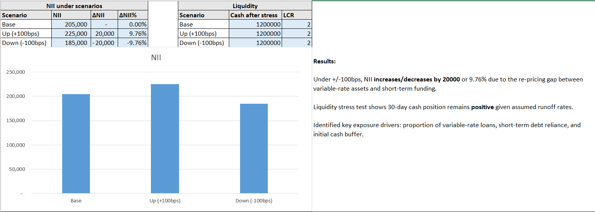

# Interest Rate Sensitivity & Liquidity Stress Test

- This project presents a simplified asset–liability and liquidity stress testing model designed to evaluate the impact of interest rate shocks on net interest income (NII) and short-term liquidity position.  
- The model is intended for educational and analytical demonstration purposes, aligned with entry-level risk, treasury, and financial analyst workflows.

---

## Overview

The model evaluates how interest rate shocks affect:
- Net Interest Income (NII)
- Cash position after liquidity stress
- A simplified Liquidity Coverage–style metric
  
---

## Model Structure

The Excel file is organized into three sections:

- **Inputs**
  - Simplified balance sheet (assets and liabilities)
  - Interest rate assumptions
  - Liquidity stress parameters
- **Model**
  - Interest income and expense calculations
  - Net interest income (NII)
  - Cash inflow and outflow under stress assumptions
- **Results**
  - Scenario comparison of NII
  - Cash position after stress
  - Simplified liquidity coverage metric

---

## Scenarios

The model evaluates three parallel interest rate scenarios:

- **Base Case**
- **+100 bps Rate Shock**
- **−100 bps Rate Shock**

---

## Key Outputs

- Net Interest Income by scenario
- Cash balance after liquidity stress
- Simplified liquidity coverage indicator
- Comparative scenario table for quick interpretation.

---

## Key Assumptions & Scope

For simplicity, Liquidity runoff assumptions are held constant across scenarios to isolate interest rate effects. In practice, liquidity and rate shocks can be linked, but I wanted to focus on core rate sensitivity..

---

## Content Preview

### Inputs

### Model

### Results

## Key Results
- Under +/-100bps, NII increases/decreases by 20000 or 9.76% due to the re-pricing gap between variable-rate assets and short-term funding.
- Liquidity stress test shows 30-day cash position remains positive given assumed runoff rates.
- Identified key exposure drivers: proportion of variable-rate loans, short-term debt reliance, and initial cash buffer.
- Liquidity runoff and inflow assumptions are held constant across scenarios to isolate interest rate sensitivity on net interest income. As a result, liquidity metrics do not vary by rate scenario and are intended to illustrate model structure rather than dynamic funding stress behavior.

---

